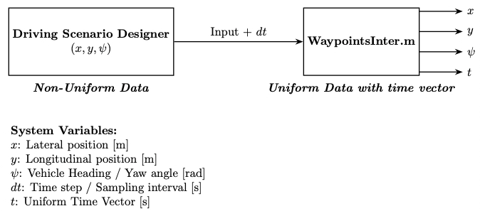

# Interpolation function for global coordinates and the yaw angle from the MATLAB Driving Scenario

The provided function (WaypointsInter.m) can generate the related uniform time vector and the uniform global position from the provided non-uniform x,y position and the yaw angle from the [MATLAB Driving Scenario Designer](https://de.mathworks.com/help/driving/ref/drivingscenariodesigner-app.html?searchHighlight=driving+scenario&s_tid=srchtitle_support_results_1_driving+scenario) app. The function is useful for trjectory and stability control design of a vehicle where can only non-uniform data is important.

The gif file of the example data after interpolation is shown below.

  

## Block Diagram

The simple block diagram of a function is:

Here, the $dt$ or the sampling time should be the same as the sampling time of the MATLAB DrivingScenarion. To check the MATLAB Driving Scenario Designer sampling time go to the setting of the Designer app and adjust it. This app only provide the sampling time in the miliseconds. 
