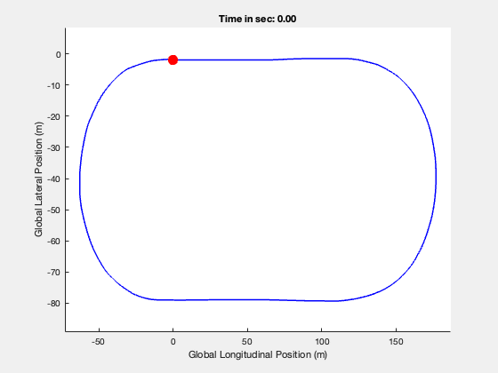

# Interpolation function for global coordinates and the yaw angle from the MATLAB Driving Scenario

The provided function (WaypointsInter.m) can generate the related time vector and the global position from the provided unsequencial x,y position and the yaw angle from the [MATLAB DrivingScenarion](https://de.mathworks.com/help/driving/ref/drivingscenariodesigner-app.html?searchHighlight=driving+scenario&s_tid=srchtitle_support_results_1_driving+scenario) app. The function is useful for trjectory and stability control design of a vehicle where the sequencial data is important.

The gif file of the example data after interpolation is shown below.

  

